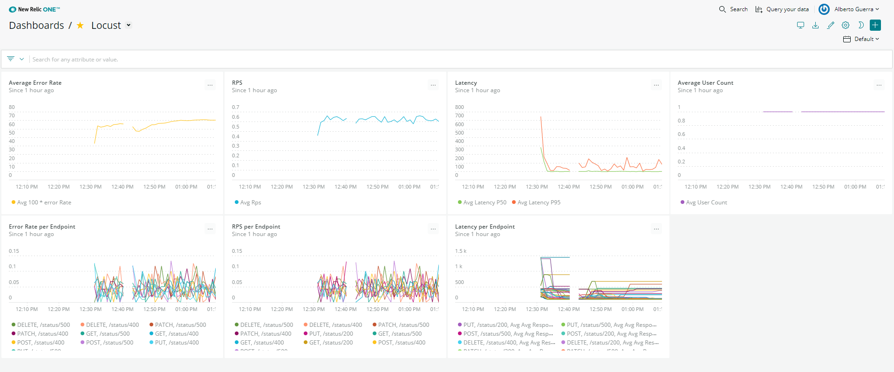

# locust-statistics-sidecar


Sidecar to push Locust statistics to NewRelic as events.

## Dasboard


### NRQL charts
| Name                    | Query                                                                                                                             |
| ----------------------- | --------------------------------------------------------------------------------------------------------------------------------- |
| Summary Error Rate      | `SELECT average(100*error_rate) FROM LocustSummary TIMESERIES AUTO `                                                              |
| Summary RPS             | `SELECT average(rps) from LocustSummary TIMESERIES AUTO`                                                                          |
| Summary Latency         | `SELECT average(latency_p50), average(latency_p95) from LocustSummary TIMESERIES AUTO`                                            |
| User Count              | `SELECT average(user_count) from LocustSummary TIMESERIES AUTO`                                                                   |
| Error Rate Per Endpoint | `SELECT average(current_fail_per_sec) FROM LocustRequestStatistics WHERE name != 'Aggregated' FACET method, name TIMESERIES AUTO` |
| RPS Per Endpoint        | `SELECT average(current_rps) FROM LocustRequestStatistics WHERE name != 'Aggregated' FACET method, name TIMESERIES AUTO`          |
| Latency Per Endpoint    | `SELECT average(avg_response_time), average(max_response_time), average(min_response_time), average(ninetieth_response_time), average(median_response_time) FROM LocustRequestStatistics WHERE name != 'Aggregated' FACET method, name TIMESERIES AUTO`                                            |

## Supported Locust versions
| Locust version | Sidecard Version |
| -------------- | ---------------- |
| 0.0.14         | 0.0.2            |
| 1.0.3          | 1.0.0            |

## Requirements
The minimum requirement to build and run this locally are:
- Docker and `docker-compose`.
- Python 3 (and pip).
- **Optional**: pycodestyle (if you want to run the linter)

## Usage
In order to use the container, run:

```
docker run --env LOCUST_URL=http://<Your Locust Host>:8089 --env NEW_RELIC_LICENSE_KEY=<Your License Key> albertowar/locust-statistics-sidecar
```

The container can be configured with the following environment variables:

| Environment           | Required | Default                   | Description                                                                               |
| --------------------- | -------- | ------------------------- | ----------------------------------------------------------------------------------------- |
| LOCUST_URL            | YES      | N/A                       | The URL of the Locust instance (when running distributed Locust, this is the master host) |
| POLL_INTERVAL_SECONDS | NO       | 30                        | The number of seconds between the action of publishing statistics                         |
| NEW_RELIC_LICENSE_KEY | YES      | N/A                       | The NewRelic license key used by the NewRelic agent                                       |
| NEW_RELIC_APP_NAME    | NO       | Locust Statistics Sidecar | The NewRelic application name to use when publishing statistics                           |
| NEW_RELIC_LOG         | NO       | `/tmp/newrelic.log`       | The path to NewRelic agent log file                                                       |
| NEW_RELIC_LOG_LEVEL   | NO       | `info`                    | The log level for NewRelic agent                                                          |

## Development
Once you have cloned the repository, the `Makefile` provides you with a few shortcuts to facilitate the development flow:
- `lint`: runs the linter on the `srs` folder.
- `image`: builds the image.
- `run`: runs the test application (Locust with a simple test script and the sidecar).
- `cleanup`: stops and removes the containers.

In order for the test application to work properly, you will also need to create an `env.list` file under `/test` with following:

```
NEW_RELIC_LICENSE_KEY=<Your License Key>
```

## Folder structure
```
├── .github
│   └── workflows      # CI workflows powered by GitHub Actions
├── test               # Used to test changes locally
    ├── locustfile     # Locust test script
    └── docker-compose # Used to run Locust and the sidecar together for testing purposes
│
├── src                # Locust Statistics Sidecar code
├── Dockerfile
├── LICENSE
├── Makefile           # Shortcuts for local development
├── README.md          # Documentation
└── requirements.txt   # Dependencies
```

## Contribute
1. Fork the repository.
2. Send a PR to `master` branch.
3. Make sure that all validation steps are passing.
4. Wait for one of the maintainers (only me for now) to review and merge.

## Release
In order to release a new image of Locust Statistics Sidecar, you should:
1. Open a PR from `master` to `release` branch.
2. Get it reviewed by one of the maintainers.
3. Squash + Merge the PR.
4. Make sure the release notes are relevant.

## FAQ
### Why did I create this tool?
[Locust](http://locust.io/) is a pretty solid open source load testing tool which enables the user to run distributed load tests using simple Python scripts to describe the scenarios.

Although its web interface has a few charts to display the test results in real-time, it has a couple of drawbacks:
- The charts are not persisted over time. Therefore, if the browser loses connection to Locust or you accidentally refresh the page, the results of the test until that point will be lost.
- The web interface focuses on displaying information for the generic use case (latency, error rate, rps), but it doesn't support more complex data visualizations (statistics per endpoint, error rate per status code, etc).

There are many alternatives that could help to solve this problem out there, however I decided to use NewRelic it is one of the most polular monitoring solutions in the industry.

With that being said, I am open to contributions that add integrations with other monitoring solutions or other improvements.

### Why not creating a library instead?
Both approaches (library vs separate container) would work but they come with advantages/disadvantages.

Using a library integrated as part of the `locustfile` (test script) would enable the NewRelic agent to push APM (CPU, Memory, etc) as well as the events which could facilitate troubleshooting of Locust performance issues if they arise.

However, this approach has some disadvantages:
* Dependency conflicts between Locust and the library.
* Monitoring library impacting the performance of Locust by taking too much memory/CPU/network resources.
* The added cost of adding APM.

In reality, you are probably going to need APM when you are integrating Locust for the first time with your infrastructure. Once you have gone through the initial tweaking phase, you will undestand well what's required for Locust to run efficiently in your environment and you will rarely look again in APM.

Using a separate container would allow us to:
* Avoid dependency issues. Since it runs on a separate container, we could even use a different programming language!
* Avoid taking stealing away compute/network resources.

This option on the other hand will prevent us from analysing any performance issues Locust might be struggling with.

With all that being said, I decided to go for the latter because I already have enough understanding of the framework. In the future, if people are interested, we could bundle the core functionality into a separate package and publish it into PyPI.
